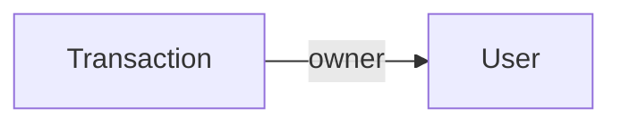

# Vefinance

Personal income & expense tracker - Full Stack app (React + Node.js + MongoDB), final project for an Advanced Full Stack course.

Vefinance lets a user register and log in (including Google Sign-In), manage their financial transactions (income/expenses), view real-time summaries and monthly trends, export a PDF report, and upload a profile picture - all in a secure, per-user-protected interface.

## Key Features

- Email/password registration and login (bcrypt + JWT)
- Google Sign-In, in addition to regular email/password login
- Full transaction management (CRUD): create, view, edit, delete
- Dashboard with real-time income/expense/balance summaries
- 3-month trend comparison (income/expenses, percent change)
- Export a financial summary as a PDF (with proper Hebrew support)
- Upload and edit profile picture and username
- Per-user data isolation (each user only sees their own transactions)
- Rate limiting and security hardening (Helmet, Joi input validation)
- Lazy loading and performance optimization (memoization)

## Tech Stack

**Backend:**
- Node.js + Express 5
- MongoDB + Mongoose
- JWT (jsonwebtoken) + bcryptjs — authentication and password hashing
- google-auth-library — Google Sign-In verification
- Joi — input validation
- Multer — file uploads
- Helmet, express-rate-limit — security

**Frontend:**
- React 19 + Vite
- React Router — navigation
- Redux Toolkit + React Redux — transaction state management
- Context API — session/auth state management
- Axios — API communication
- Tailwind CSS
- @react-oauth/google — Google Sign-In button
- jsPDF + jspdf-autotable — PDF export

## Architecture and Folder Structure

Vefinance uses a client–server architecture. The React single-page application calls a REST API over Axios. The Express API applies validation (Joi), authentication (JWT), and ownership authorization, then persists data in MongoDB through Mongoose models. Uploaded profile pictures are stored on the server's filesystem and served statically; their path is stored in MongoDB.

```
.
├── client/
│   ├── src/
│   │   ├── components/       # Reusable UI (AvatarUpload, EditProfile, TransactionRow, MonthlyTrend, PrivateRoute)
│   │   ├── context/          # AuthContext — user session, login/logout
│   │   ├── pages/            # Login, Register, Dashboard, TransactionForm, NotFound
│   │   ├── services/         # api.js — axios instance with JWT interceptor
│   │   ├── store/            # Redux store + transactionsSlice
│   │   ├── utils/            # monthlyStats.js, exportPdf.js
│   │   ├── App.jsx           # Routes, lazy-loaded pages
│   │   └── main.jsx          # Providers (Redux + Auth) and entry point
│   └── vite.config.js
├── server/
│   ├── controllers/           # authController, transactionController
│   ├── middleware/            # authMiddleware (protect), validate, upload (Multer), errorHandler, logger, rateLimiter
│   ├── models/                # User, Transaction (Mongoose schemas)
│   ├── routes/                # authRoutes, transactionRoutes
│   ├── validation/            # Joi schemas
│   ├── uploads/                # Uploaded profile pictures (not committed)
│   └── server.js               # Express app, MongoDB connection, server startup
└── README.md
```

## MongoDB Schema and Collection Relationships



| Model | Default collection | References |
|---|---|---|
| `User` | `users` | Standalone. Stores `name`, `email` (unique), `password` (bcrypt-hashed via pre-save hook, excluded from queries by default via `select:false`), `role`, `avatarUrl`. |
| `Transaction` | `transactions` | `owner` references the creating `User` (`ObjectId`, required). Every query is filtered by `owner` to enforce per-user data isolation. |

Every model uses Mongoose `timestamps`, adding `createdAt`/`updatedAt` automatically. Transactions are always sorted by their business `date` field (newest first) — not by `createdAt` — since a transaction's business date can differ from when it was entered into the system.

## Local Setup

### Prerequisites
- Node.js (version 18 or higher)
- MongoDB running locally (`mongodb://localhost:27017`) or a MongoDB Atlas connection

### Steps

1. **Clone the repository**
   ```bash
   git clone https://github.com/veredsadde2498-cmyk/full-stack-adv.git
   cd full-stack-adv
   ```

2. **Install server dependencies**
   ```bash
   cd server
   npm install
   ```
   Create a `.env` file in `server/` (see `.env.example`):
   ```
   PORT=5000
   DATABASE_URL=mongodb://localhost:27017/vefinance
   JWT_SECRET=<random secret string, at least 32 characters>
   JWT_EXPIRES_IN=7d
   GOOGLE_CLIENT_ID=<Client ID from Google Cloud Console>
   ```

3. **Install client dependencies**
   ```bash
   cd ../client
   npm install
   ```
   Create a `.env` file in `client/` (see `.env.example`):
   ```
   VITE_API_URL=http://localhost:5000/api
   VITE_GOOGLE_CLIENT_ID=<same Client ID as the server>
   ```

4. **Run** (in two separate terminals)
   ```bash
   # Terminal 1 — server
   cd server
   npm run dev

   # Terminal 2 — client
   cd client
   npm run dev
   ```

5. Open in browser: `http://localhost:5173`

## API Endpoints

### Auth (`/api/auth`)

| Method | Endpoint | Description | Access |
|---|---|---|---|
| POST | `/api/auth/register` | Register a new user | Public |
| POST | `/api/auth/login` | Log in with email/password | Public |
| POST | `/api/auth/google` | Log in/register with Google | Public |
| GET | `/api/auth/me` | Current logged-in user's details | Protected |
| PUT | `/api/auth/profile` | Update username | Protected |
| PUT | `/api/auth/avatar` | Upload profile picture | Protected |

### Transactions (`/api/transactions`)

| Method | Endpoint | Description | Access |
|---|---|---|---|
| POST | `/api/transactions` | Create a new transaction | Protected |
| GET | `/api/transactions` | All transactions for the current user (sorted by date) | Protected |
| GET | `/api/transactions/:id` | Single transaction | Protected |
| PUT | `/api/transactions/:id` | Update a transaction | Protected |
| DELETE | `/api/transactions/:id` | Delete a transaction | Protected |

All protected endpoints require the header: `Authorization: Bearer <token>`.

## Screenshots

Below are a few screenshots of Vefinance in action, taken from the live deployment.

**Login** 


email/password sign-in, with Google Sign-In as an alternative option.


**Dashboard**


Real-time income/expense/balance summaries, a 3-month trend comparison, and the full transaction list.


**New Transaction**


Form for creating or editing a transaction, with client-side validation.


**404 Page**


A friendly error page for undefined routes, with a link back to the app.


**PDF Export**


Exported financial summary with a real Hebrew font embedded, generated entirely client-side.


## Team

Solo project.

| Name | Role |
|---|---|
| Vered Sade | Full Stack Development |

## Live Deployment

- Frontend (Vercel): https://full-stack-adv.vercel.app
- Backend (Render): https://vefinance-server.onrender.com


